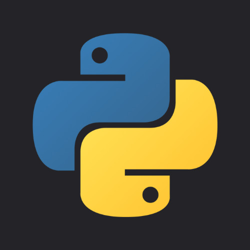
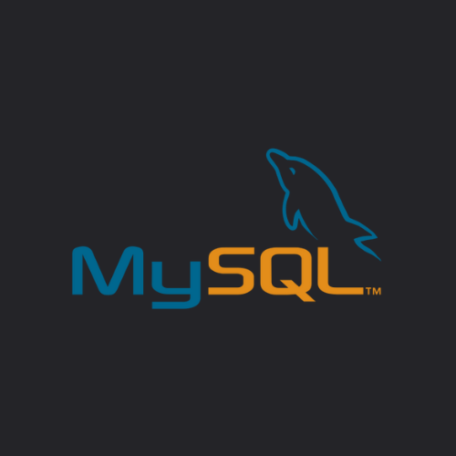
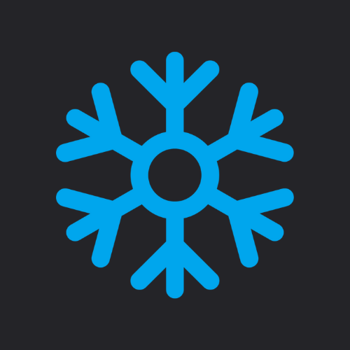
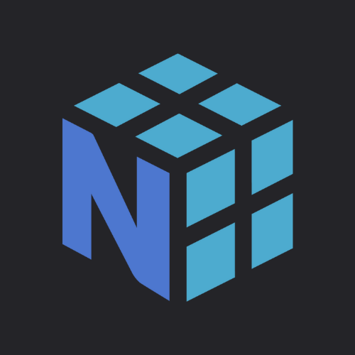
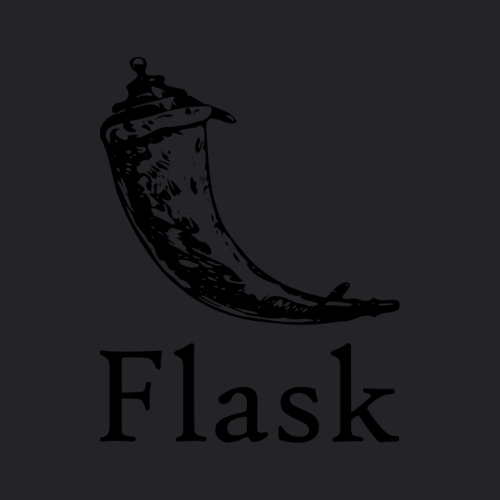
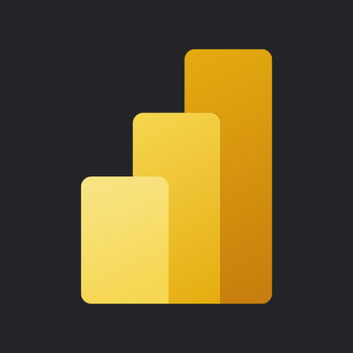
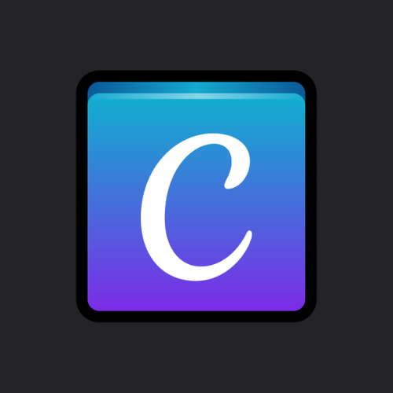

  

# 👋 Hi I'm Zaid Ahamed
  

I'm a Computer Engineering student with Expertise in Data Engineering and Analysis who thrives to learn new things and solve problems using modern solutions.
  

## 💻 Technical Skills
 

- **Languages:** Python, SQL, Shell

- Frameworks: Flask, Pandas, NumPy, Matplotlib

- **Databases:** MySQL, PostgreSQL, Snowflake (DataWarehouse)

- Data: Data Extraction, Data Cleaning, Data Analysis, Statistical Analysis, Data Visualization, Dashboard Building

- **Tools:** Tableau, PowerBI, MS Office, ChatGPT, Canva, Apache Airflow

- **Others:** Linux, API Development, Web Scraping, ETL/ELT, Version Control (Git), Testing/Debbugging

- Concepts: OOP (Object Oriented Programming), DSA (Data Structures & Algorithms), DBMS (Database Management System), BigData, Data Warehousing

- Data Collection, Data Tranformation, Data Cleaning, Data Modelling, Data Ingestion, Data Visualization.

- **Cloud:** AWS (S3, EC2, Lambda, IAM)  

    
    
      
    
    
      
    
    
    
    
      
    
    
      
    
    

    
  

## :brain: Soft Skills 
 

* Time Management
* Adaptability
* Communication
* Problem Solving 
  

## 🛠 Projects  

- **[Satalite Image Data Extraction Project](https://github.com/zaid638/GEE-Data-Extraction)**: 
Created ETL data pipeline to extract satellite imagery data for a Pakistan over the past year (2024) using Google Earth Engine (GEE), and process the data to calculate NDVI (Normalized Difference Vegetation Index is a metric used to measure the health and density of vegetation) and store the processed data in a PostgreSQL database for further analysis. Visualize the data in a Webapp using NDVI color scheme.  

- **[Job Analysis Project](https://github.com/zaid638/Job-Analysis-Project)**: 
Analyze job postings to identify trends and insights in job requirements to help job seekers and recruiters understand the current job market.  

- **[AtliQ Grands Hotel Dashboard](https://github.com/zaid638/Analysis-of-AtliQ-Grands-Hospitality-Domain)**: 
A business intelligence dashboard for a luxury hotel chain.  

- **[Technology Trends Analysis](https://github.com/zaid638/IBM-Capstone-Project)**: 
This project demonstrated proficiency in applying different Analytical techniques by Analyzing Job Dataset.  

- **[Tourism Management System](https://github.com/zaid638/Tourism-Management-System)**: 
A web application designed to manage and streamline tourism activities efficiently.  

- **[Online Banking System](https://github.com/zaid638/Online-Banking-System)**: 
A simple online banking system created using Python Object Oriented Programming concept.   

### [Other Projets](https://github.com/zaid638?tab=repositories)  

## 🌐 Connect with Me 

 

  

<!--

- 🔭 I’m currently working on data related Projects.
 

- 🌱 I’m currently learning Data Engineering Concepts.
 

- 👯 I’m looking to collaborate on data related projects.
- 🤔 I’m looking for help with ...
- 💬 Ask me about ...
- 😄 Pronouns: ...
- ⚡ Fun fact: ...
-->

