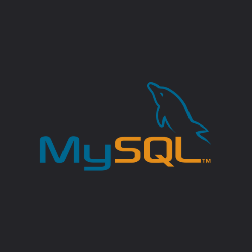

  

# 👋 Hi I'm Zaid Ahamed  

## Data Engineer | Data Analytics | Building Scalable, Data-Driven Systems  

I’m a Data Engineer and Data Analytics who enjoys building robust pipelines, automating data flows, and designing analytical systems that transform raw data into insight.  

---

### ⚙️ Tech Stack   

    
    
      
    
    
      
    
    
    
    
      
    
    
      
    
    
    
    
    
    

    
  

---

### ✅ Real-World Project Experience 

- **NDVI ETL Pipeline:** Extracted vegetation index data from Google Earth Engine → transformed and stored in PostgreSQL.[more](https://github.com/zaid638/GEE-Data-Extraction)
- **FMCG End-to-End Lakehouse Pipeline:** build a scalable data pipeline to consolidate, transform, and analyze data from both Parent and Child organizations using a Lakehouse architecture.[more](https://github.com/zaid638/FMCG-End-to-End-Lakehouse-Pipeline)
- **CRM/ERP Data Warehouse:** Centralized multi-source business data for analytics and ML.[more](https://github.com/zaid638/sql-data-warehouse-project)
- **Job Analytics System:** Automated job data scraping and built Power BI dashboards to analyze skills, roles, and salary trends.[more](https://github.com/zaid638/Job-Analysis-Project)
- **Marketing Data ETL:** Data pipeline with validation, logging, and performance optimization.[more](https://github.com/zaid638/Marketing-ETL-Pipeline)
- **AtliQ Grands Dashboard:** Data cleaning, transformation, and KPI visualization for hospitality analytics.[more](https://github.com/zaid638/Analysis-of-AtliQ-Grands-Hospitality-Domain)  

---

### 📚 Currently Exploring 

- Cloud Data Engineering (AWS, Snowflake)
- DataOps & Workflow Orchestration (Automation, Scheduling)
- LLM-powered Automation in Data Pipelines 

💬 Let’s collaborate! Check out my repositories or connect on LinkedIn.   

## 🌐 Connect with Me 

 

 

  

<!--

- 🔭 I’m currently working on data related Projects.
 

- 🌱 I’m currently learning Data Engineering Concepts.
 

- 👯 I’m looking to collaborate on data related projects.
- 🤔 I’m looking for help with ...
- 💬 Ask me about ...
- 😄 Pronouns: ...
- ⚡ Fun fact: ...
-->

