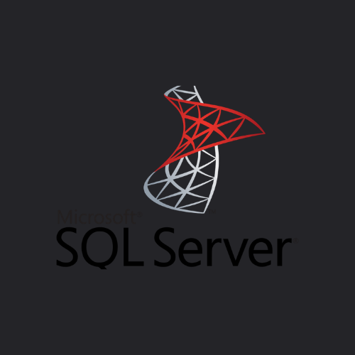
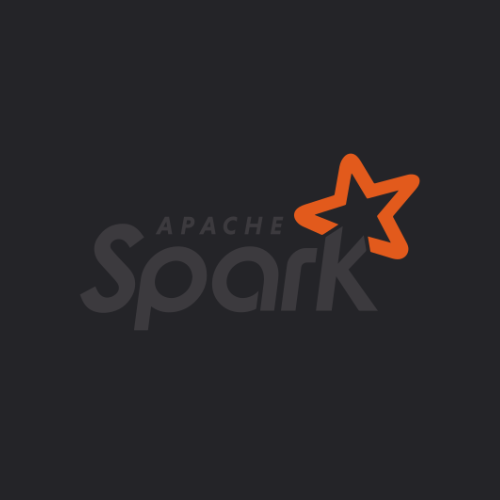

# 👋 Hi, I'm Zaid Ahamed

### Data Engineer building reliable ETL pipelines, lakehouse architectures, and cloud data platforms

I design and build data pipelines that move raw, messy data into clean, analysis-ready systems — from cross-cloud database recovery to lakehouse platforms processing multi-source business data. I care about pipelines that don't just run once, but stay observable, maintainable, and production-ready.

---

## ⚙️ Tech Stack

**Languages & Databases**

    
    
    
    

**Cloud & Big Data**

    
    
    
    
    
    

<!--**Orchestration & BI**

-->

**Others**

    
        
    

<!-- *(Tableau and Azure Blob Storage are also part of my active toolkit — see Featured Projects below.)* -->

---

## 🚀 Featured Projects

**[Google Drive → BigQuery Serverless ETL Pipeline](https://github.com/zaid638/Google-Drive-BigQuery-Serverless-ETL-Pipeline)**
A data pipeline that ingests Google Sheets from a Drive folder, lands them in BigQuery as standardized bronze tables, and merges them into a unified, cleaned silver table that is fully automated on GCP.

**[Data Pipeline Migration: VM Cron Job → GCP Cloud Function](https://github.com/zaid638/Data-Pipeline-Migration-VM-Cron-Job-GCP-Cloud-Function)**
Migrated a daily healthcare-data ingestion pipeline from a VM to a serverless Cloud Function, adding proper failure alerting, and eliminating a class of concurrency bugs along the way.

**[FMCG End-to-End Lakehouse Pipeline](https://github.com/zaid638/FMCG-End-to-End-Lakehouse-Pipeline)**
Built a Lakehouse platform simulating a company acquisition, consolidating parent and subsidiary datasets across Bronze/Silver/Gold layers using AWS S3, Databricks, and Apache Spark.

**[Cross-Cloud SQL Server Restoration Pipeline](https://github.com/zaid638/HA-Data-Pipeline-Project-1)**
Automated SQL Server database restoration using backup files moved from Azure Blob Storage to GCP, with centralized logging, monitoring, and email alerting for disaster-recovery scenarios.

**[CRM/ERP Data Warehouse (Medallion Architecture)](https://github.com/zaid638/sql-data-warehouse-project)**
Unified ERP and CRM data into a single PostgreSQL warehouse using Bronze/Silver/Gold layering and star-schema modeling to support customer, product, and sales analytics.

**[NDVI ETL Pipeline (Google Earth Engine → PostgreSQL)](https://github.com/zaid638/GEE-Data-Extraction)**
Built a geospatial ETL pipeline extracting vegetation index (NDVI) data from Google Earth Engine into PostgreSQL — the technical basis for a research paper I authored on the topic.

**[Job Market Analytics Platform](https://github.com/zaid638/Job-Analysis-Project)**
Automated weekly job data scraping from TopJobs.lk with Python and BeautifulSoup, feeding a Power BI dashboard analyzing in-demand skills, roles, and salary trends.

**[AtliQ Grands Hospitality Dashboard](https://github.com/zaid638/Analysis-of-AtliQ-Grands-Hospitality-Domain)**
Designed an executive Power BI dashboard tracking Occupancy, ADR, and RevPAR to help a hotel chain identify revenue leakage.

**Additional experience:** 
- Event-driven reservation ingestion (Guesty API → Pub/Sub → BigQuery)
- Incremental API extraction with pagination and OAuth (Breezeway API)
- A pipeline health-monitoring dashboard in Tableau
- Data pipiline migrating and orchestration from Apache Airflow to Google Cloud Functions.

---

## 🎓 Certifications & Research

- **Data Engineer in Python** — DataCamp
- **Associate Data Engineer in SQL** — DataCamp
- Authored a research paper on the **Google Earth Engine NDVI ETL Pipeline** project

---

## 📚 Currently Working On

- Cloud Data Engineering (GCP)
- DataOps & Workflow Orchestration (automation, scheduling)
- LLM-powered automation in data pipelines

---

## 💼 Open to Opportunities

I'm open to **full-time, part-time, freelance, and remote** roles, as well as **open-source collaboration** and interesting side projects. If you're working on data infrastructure, pipelines, or analytics platforms, let's talk.

---

## 🌐 Connect with Me

<!--  -->

